<picture>
  <source media="(prefers-color-scheme: dark)" srcset="./assets/v2/header-dark.svg">
  
</picture>

  

🎨 Currently focused on <b>UI/UX and front-end</b> — designing and building clean, intuitive interfaces with React, TypeScript and Tailwind. 
⚙️ Grounded in low-level systems: Linux kernel programming, eBPF, bare-metal ARM, and CPU design in Verilog. 
🧠 Hands-on with deep learning and computer vision, from neural networks built from scratch to real-time vision pipelines. 
🖥️ Also explored 3D graphics in C++ (Direct3D 11, OpenGL ES) and security — web vulnerabilities, memory exploits, and fuzzing.

 

<picture>
  <source media="(prefers-color-scheme: dark)" srcset="./assets/v2/label-focus-dark.svg">
  
</picture>

<picture>
  <source media="(prefers-color-scheme: dark)" srcset="./assets/v2/focus-dark.svg">
  
</picture>

  

<picture>
  <source media="(prefers-color-scheme: dark)" srcset="./assets/v2/label-stack-dark.svg">
  
</picture>

 

<b>LANGUAGES</b>
  

  

<b>FRAMEWORKS &AMP; LIBRARIES</b>
  

  

<b>TOOLS</b>
  

   

<picture>
  <source media="(prefers-color-scheme: dark)" srcset="./assets/v2/label-contact-dark.svg">
  
</picture>

 

<a href="mailto:seunghunizm@gmail.com">
<picture>
  <source media="(prefers-color-scheme: dark)" srcset="./assets/v2/contact-dark.svg">
  
</picture>
</a>

   

<picture>
  <source media="(prefers-color-scheme: dark)" srcset="./assets/v2/footer-dark.svg">
  
</picture>

